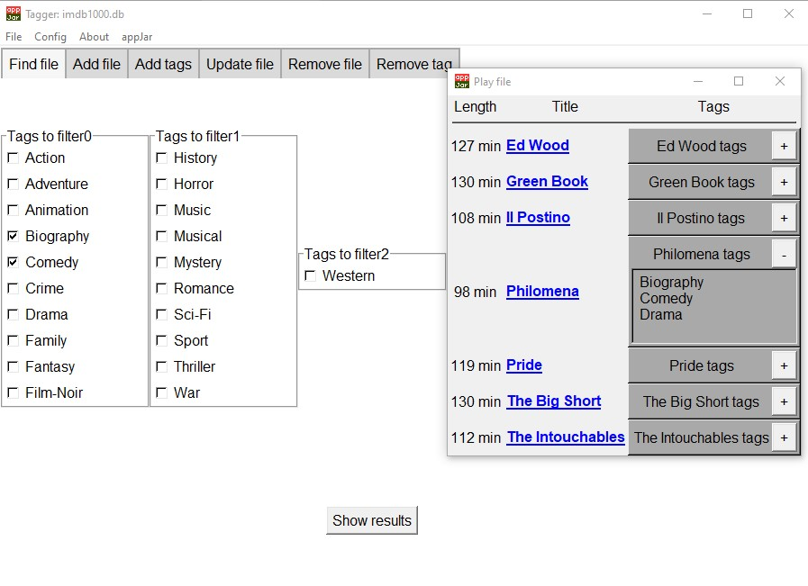
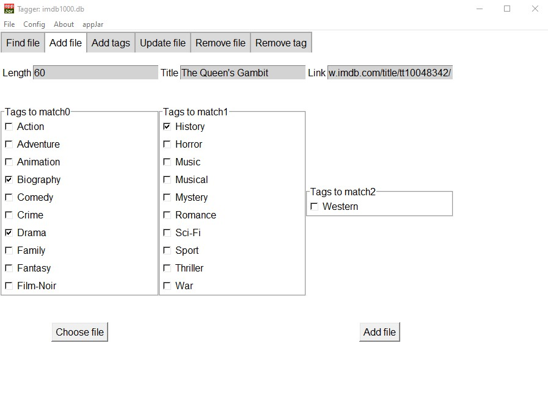
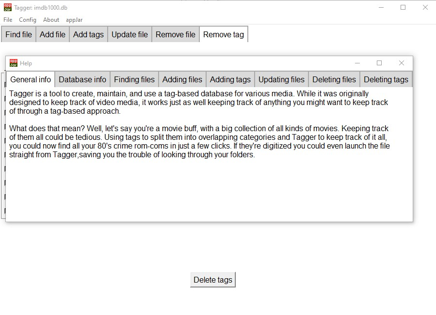

<!--
*** Readme template by: https://github.com/othneildrew/Best-README-Template
-->


<!-- PROJECT LOGO -->
<br />
<p align="center">

  <h3 align="center">Tagger</h3>

  <p align="center">
    Tagger is an application for managing and manipulating a tag-based database primarily aimed towards media.
    <br />
    <a href="https://github.com/Jonas-Wennerstrom/Tagger/Tagger documentation.pdf"><strong>Explore the docs »</strong></a>
    <br />
  </p>
</p>


<!-- TABLE OF CONTENTS -->
<details open="open">
  <summary><h2 style="display: inline-block">Table of Contents</h2></summary>
  <ol>
    <li>
      <a href="#about-the-project">About The Project</a>
      <ul>
        <li><a href="#built-with">Built With</a></li>
      </ul>
    </li>
    <li>
      <a href="#getting-started">Getting Started</a>
      <ul>
        <li><a href="#prerequisites">Prerequisites</a></li>
        <li><a href="#installation">Installation</a></li>
      </ul>
    </li>
    <li><a href="#usage">Usage</a></li>
    <li><a href="#license">License</a></li>
  </ol>
</details>


<!-- ABOUT THE PROJECT -->
## About The Project

Tagger is a GUI for manipulating a tag-based database aimed towards keeping track of media. It provides full control over the database, including creation, from the GUI. The entire program is written in Python (apart from the database creation which is in raw SQL).

This is a personal project created for the purposes of learning basic Python and to manage my own disparate media collections.

Also included in the repo is a website scraper with creates a database of the top 1000 movies on imdb.com and a finished such database. These are included for testing and example purposes.

### Built With

* [SQLite3](https://www.sqlite.org/index.html)
* [SQLAlchemy](https://www.sqlalchemy.org/)
* [appJar](http://appjar.info/)


<!-- GETTING STARTED -->
## Getting Started

To get a local copy up and running follow these simple steps.

### Prerequisites

Everything necessary to build the project can be installed through pip. SQLite is included as standard in Python starting from 3.0.
  ```sh
  pip3 install appjar
  pip install sqlalchemy
  ```

### Installation

1. Clone the repo
   ```sh
   git clone https://github.com/Jonas-Wennerstrom/Tagger.git
   ```
2. Install packages
   ```sh
   pip3 install appjar
   pip install sqlalchemy
   ```


<!-- USAGE EXAMPLES -->
## Usage

Using Tagger is quite straightforward: The main window consists of 6 tabs with self-explanatory titles:
* Find file
* Add file
* Add tags
* Update file
* Remove file
* Remove tag

The entire functionality of the application is centered on the tags: To finda file, you check mandatory tags for the file to be matched with. To add a file, you input its length, title, and link (length and link are optional), check which tags apply, and commit. More exact instructions are available under the Help menu.

Tags and file titles need to be unique. Deleting tags is generally discouraged as it may leave files without any tag, and thus 'lost' in the database. The capability to delete all such 'lost' files is provided in the menu.


This is what Tagger looks like upon launch and loading a database (in this case the top 1000 movies on imdb.com). To find a movie, check the tags you want and press 'Show results'.



This is what you will be shown. A list of all movies which have all the tags marked, with a collapsible list of all tags they have, and the titles as links.



Adding a new file is quite straightforward. Note the ability to get title and path from a file.



A user-friendly documentation of the entire functionality is available through the menu.

_For more examples, please refer to the [Documentation](https://example.com)_


<!-- LICENSE -->
## License

Distributed under the MIT License. See `LICENSE` for more information.


<!-- CONTACT -->
## Contact

Your Name - [@twitter_handle](https://twitter.com/twitter_handle) - email

Project Link: [https://github.com/Jonas-Wennerstrom/Tagger](https://github.com/Jonas-Wennerstrom/Tagger)


<!-- MARKDOWN LINKS & IMAGES -->
<!-- https://www.markdownguide.org/basic-syntax/#reference-style-links -->
[license-shield]: https://img.shields.io/github/license/Jonas-Wennerstrom/repo.svg?style=for-the-badge
[license-url]: https://github.com/Jonas-Wennerstrom/repo/blob/master/LICENSE.txt
